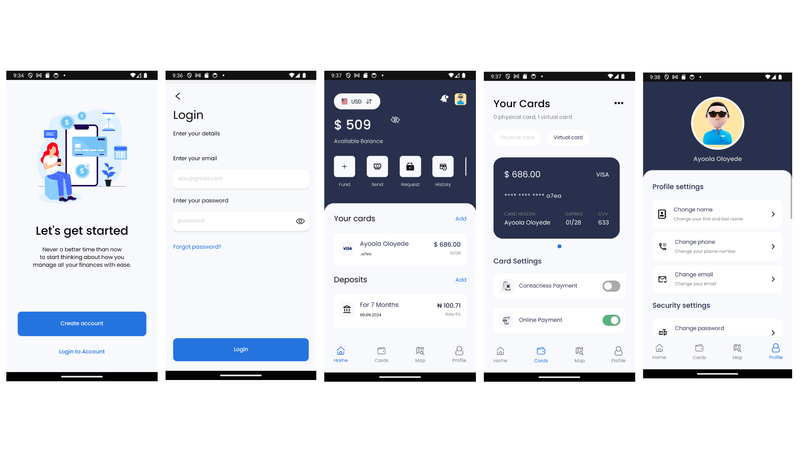

## Funola Mobile Banking Application

### A mobile banking application that helps you effectively manage your personal finance.

#### DISCLAIMER: This app was designed by [Nikita Ogurechnikov](https://www.behance.net/candier) on [Behance](https://www.behance.net/gallery/92747605/Mobile-bank-app) and was implemented by me solely for learning purposes and is not intended for commercial usage in any way.


## Table of Contents
- [Demo](#demo)
    - [React Native](#react-native)
    - [Flutter](#flutter)
- [Features](#features)
- [React Native - Installing on Android/IOS](#react-native---installing-on-androidios)
- [Screenshots](#screenshots)
    - [React Native](#react-native-screenshots)
    - [Flutter](#flutter-screenshots)
- [Running Locally](#running-locally)
    - [Running the React Native mobile app](#running-the-react-native-app)
    - [Running the Flutter mobile app](#running-the-flutter-app)
    - [Running the backend](#running-the-backend)
- [Contact](#contact)

### Demo
#### React Native
- 
#### Flutter

### Features
- Account Management
- Convenient Mobile Deposits
- Card Management
- Wallet Management
- Cookie authentication and jwt authorization for login
- Locate nearby ATMs with ease
- Alerts and notifications
- Money Transfer (not real money 😔)
- Live currency conversion
- Round-the-Clock Customer Support 😇

### React Native - Installing on Android/IOS
- To install on Android/IOS, you will need to first have Expo GO installed on your device(s).

    - For Android devices, you can install using this [link](https://play.google.com/store/apps/details?id=host.exp.exponent&hl=en&gl=US).
    - For IOS devices, you can install using this [link](https://apps.apple.com/us/app/expo-go/id982107779).

- After installing Expo GO, just scan the QR code below:


### Screenshots
#### React Native Screenshots


#### Flutter Screenshots

### Running Locally

#### Running the React Native App
- To run the react native app, first clone it using the command below:
```bash
git clone --single-branch -b react-native-frontend https://github.com/Josh-Ay/funola-bank-app.git
```
- Install all required dependecies using the following command:
```bash
npm install
```
- You can then start up the app on your emulator by using:
```bash
npm start
```

#### Running the Flutter App
- To run the flutter app, first clone it by using the command below:
```bash
git clone --single-branch -b flutter-frontend https://github.com/Josh-Ay/funola-bank-app.git
```
- Install all required dependecies using the following command:
```bash
flutter pub get
```
- Open the `main.dart` file in the `lib` folder. You can then start up the app on your emulator by using:
```bash
flutter run lib/main.dart
```

#### Running the backend
- To run the backend, first clone it using the command below:
```bash
git clone --single-branch -b backend https://github.com/Josh-Ay/funola-bank-app.git
```
- Details on how to run the backend can be found here: <a href='https://github.com/Josh-Ay/funola-bank-app/tree/backend' target='_blank' rel='noreferrer noopener'>Running the backend</a>

### Contact
- GitHub [@Josh-Ay](https://github.com/Josh-Ay)
- Email [Say Hi](mailto:ayo.oloyede16@gmail.com)